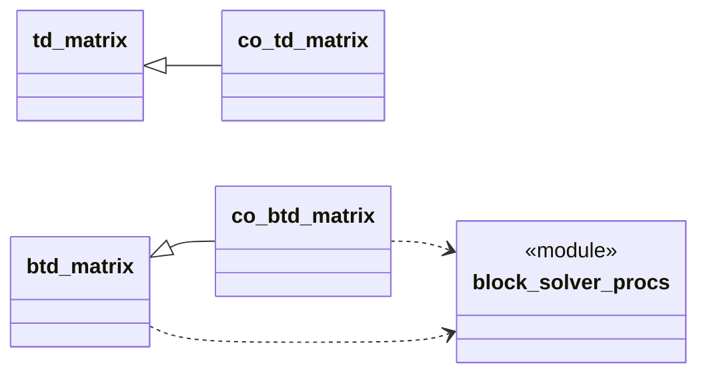
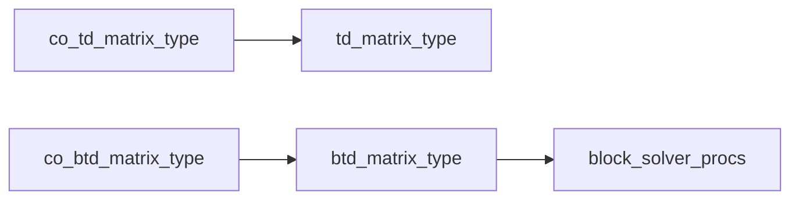

# Tridiagonal Linear System Solvers

This directory contains several modules that define derived types for storing
tridiagonal matrices with methods for solving associated linear systems and
matrix-vector products. The derived types also provide optional support for
periodic tridiagonal matrices and linear systems. These are suitable for
diagonally-dominant matrices or other matrix types that do not require
pivoting for stability when factoring. The modules are

* `td_matrix_type` -- standard tridiagonal matrix
* `btd_matrix_type` -- block tridiagonal matrix
* `co_td_matrix_type` -- parallel version of `td_matrix_type` using coarrays
* `co_btd_matrix_type` -- parallel version of `btd_matrix_type` using coarrays
  
For the parallel versions, the rows (or block rows here and following) of the
matrix (and the corresponding unknowns) are partitioned with successive
partitions stored in successive images. The last row of each partition (except
the last if not periodic), which couples unknowns in adjacent images, are
*boundary* rows. The remaining rows are *interior* rows. To compute an LU
factorization of the matrix, the interior rows are first eliminated. This is
done in parallel and requires no communication between images. This leaves a
reduced tridiagonal Schur complement system involving just the boundary
unknowns (one per image) whose LU factorization is computed in serial.

## Class Diagram


## Module Dependency


## Compiling and Testing
From the directory containing this README file:
```sh
$ mkdir build
$ cd build
$ cmake ..
$ make
$ ctest -V
```
The CMake build system understands the NAG, Intel oneAPI classic `ifort` and
LLVM-based `ifx`, and gfortran/opencoarray compilers. You may need to set your
`FC` environment variable to the path to your compiler before running `cmake`.
For gfortran you must set `FC=caf` (the compiler wrapper `caf` is provided by
opencoarrays).

The test problems in the `test` directory serve as usage examples.

## Status

* All tests are working with the above mentioned compilers with one exception:
  the parallel block tridiagonal test currently fails with NAG due to a
  coarray-bug in the compiler (due to be fixed very shortly).
* The perfomance of the parallel versions is currently quite disappointing and
  is being investigated.